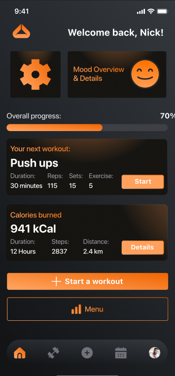
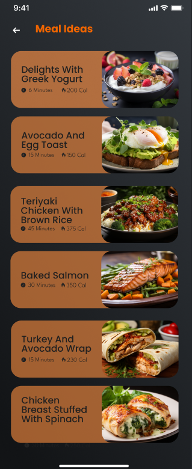
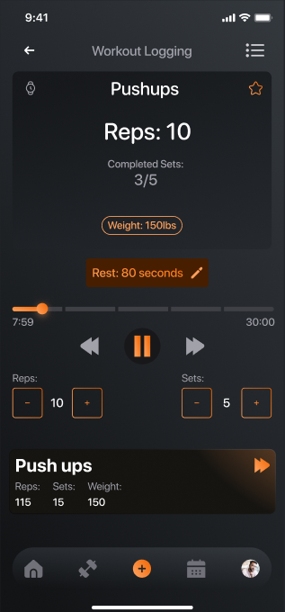

# Zenfit 🧘‍♂️💪

**Zenfit** is an all-in-one health and wellness platform for Android. It goes beyond simple tracking by integrating nutrition logging, custom workout architecture, and mood analytics into a single, cohesive experience. 

  

---

## 🚀 Key Features

### 🥗 Nutrition & Meal Management
- **Meal Intelligence:** Browse a library of meal ideas and log daily intake with detailed calorie/macro tracking.
- **Multimedia Logging:** Upload meal photos directly via the integrated camera and FileProvider system.
- **History & Trends:** View a comprehensive history of past meals to maintain consistency.

  
  

### 🏋️‍♂️ Custom Workout Engine
- **Workout Library:** Access a pre-built library of exercises or create custom routines.
- **Queue Manager:** An intelligent `WorkoutQueueManager` handles active sessions and ensures data integrity.
- **History Tracking:** Visual logs of past workouts to monitor strength and endurance gains.

### 🧠 Holistic Wellness
- **Mood Tracking:** A dedicated mood screen to correlate physical activity with mental health.
- **Push Notifications:** Real-time motivation and reminders delivered via **Firebase Cloud Messaging (FCM)**.

---

## 🏗 System Architecture

Zenfit utilizes a **Client-Server-Cloud** model:

  

1.  **Mobile Client:** Handles UI logic and local caching via `CacheManager`.
2.  **REST API:** PHP endpoints handle business logic and MySQL interaction.
3.  **Firebase:** Operates as the signaling layer for push notifications.

---

## 🛠 Tech Stack

- **Client:** Native Android (Kotlin, JVM 11), Volley, Gson.
- **Backend:** PHP REST API + MySQL Database.
- **Real-Time:** Firebase (FCM, Auth, Google Services).
- **UI:** Material Design & Framer-style transitions.

---
